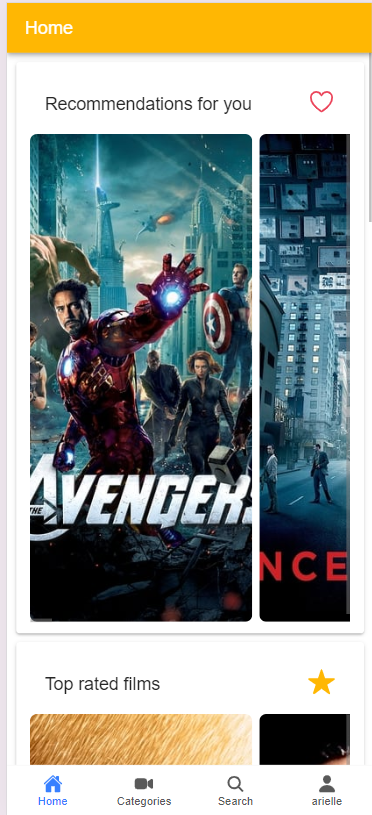

## MOVIE APP IONIC
Ce projet consiste à développer une application web qui permet aux différents utilisateurs de rechercher des films et d'obtenir des informations sur ceux-ci. L'application doit être développée en utilisant le Framework Angular/IONIC, et doit communiquer avec une API REST de films(moviedb pour ce projet) pour récupérer les informations cinématographiques : dernières sorties, les plus populaires, …
Voici l’ensemble des fonctionnalité devront y être incluse :
Recherche de films : les utilisateurs doivent pouvoir rechercher des films par titre, genre, acteur, réalisateur ou année de sortie.
Affichage des détails des films : les utilisateurs pourront consulter les détails des films, tels que le synopsis, la distribution, les acteurs, le pays d’origine, …
Recommandations de films : l'application doit proposer des recommandations de films en fonction des préférences de l'utilisateur et de ses historiques de recherche (films dans le même type, les mieux notés, pour l’acteur qui a été le plus recherché, …).
Gestion de favoris : les utilisateurs pourront ajouter des films à leur liste de favoris, en spécifiant des titres de chacune des listes de favoris personnalisées.
Lors de la navigation et visualisation des différents films, l’utilisateurs pourrait marquer un film avec le label ‘Watch Later’, afin de garder un suivi des films qu’il trouve intéressant et qu’il souhaite voir.

## Captures d'écran

### Écran d'accueil


### Page home


### Page home

### Page add movie to favoris

### Page user profile

### Page actor

### Page actor

### Page detail movie

### Page detail movie

### Page login

### Page movie by category

### Page search movie

### page category


## Installation

1. Clonez ce dépôt :
   ```bash
   git clone https://github.com/arielle-k/tmdb-movie.git

